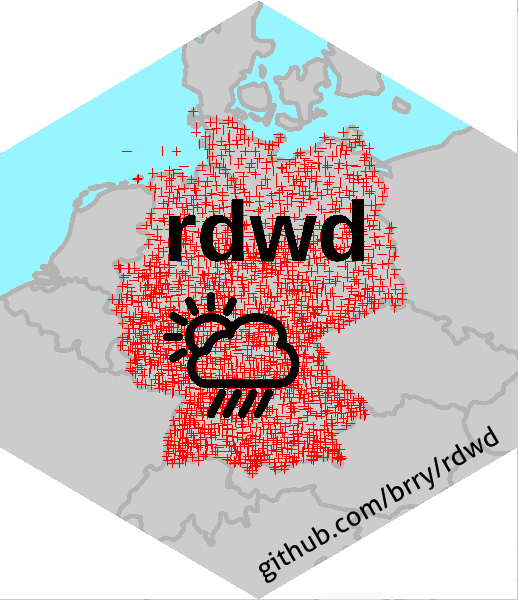

# rdwd


`rdwd` is an [R](https://www.r-project.org/) package to select, download and read climate data from the 
German Weather Service (Deutscher Wetterdienst, DWD).  
The DWD provides thousands of datasets with weather observations online at 
[opendata.dwd.de](https://opendata.dwd.de/climate_environment/CDC/observations_germany/climate).  
Since May 2019, `rdwd` also supports reading the Radolan (binary) raster data at 
[grids_germany](https://opendata.dwd.de/climate_environment/CDC/grids_germany).

`rdwd` is available on CRAN:
[](https://cran.r-project.org/package=rdwd) 
[](https://www.r-pkg.org/services)
[](https://www.rdocumentation.org/packages/rdwd)


It has been presented at [FOSDEM 2017](https://fosdem.org/2017/schedule/event/geo_weather/)
and [UseR!2017](https://user2017.sched.com/event/Axr3/rdwd-manage-german-weather-observations) in Brussels,
featured in Rstudios [data package list](https://www.rstudio.com/rviews/2017/02/17/january-new-data-packages/) 
and written about in [OSOR](https://joinup.ec.europa.eu/community/osor/news/study-german-weather-data-made-easy-rdwd).


### Documentation

A vignette with more information, examples, use cases and an interactive map of the DWD stations
can be found at <https://bookdown.org/brry/rdwd>


### Installation

**Normal**:
```R
# download and install the package:
install.packages("rdwd")
```

**Latest version**:
```R
# latest development version (incl. vignettes), if wanted:
if(!requireNamespace("remotes", quietly=TRUE)) install.packages("remotes")
remotes::install_github("brry/rdwd", build_opts="--no-manual")
```
Note: on Windows, you need to have [Rtools](https://cran.r-project.org/bin/windows/Rtools/)
installed directly at `C:/Rtools`  
(Compiler paths may not have spaces, as there would be with `C:/Program Files/R/Rtools/`).

**Full**:
```R
# For full usage, as needed in indexFTP and selectDWD(..., current=TRUE):
install.packages("RCurl") # is only suggested, not mandatory dependency
```
Note: on Linux (Ubuntu), instead call via the terminal (CTRL+ALT+T, note lowercase rcurl):
```
sudo apt install r-cran-rcurl
```


### Usage

Usage for observational weather data from the measuring stations usually looks something like the following:

```R
# load the package into library (needed in every R session):
library(rdwd)

# select a dataset (e.g. last year's daily climate data from Potsdam City):
link <- selectDWD("Potsdam", res="daily", var="kl", per="recent")

# Actually download that dataset, returning the local storage file name:
file <- dataDWD(link, read=FALSE)

# Read the file from the zip folder:
clim <- readDWD(file, varnames=TRUE)

# Inspect the data.frame:
str(clim)
```

For data interpolated onto a 1 km raster, including radar data up to the last hour,
see the corresponding [chapter](https://bookdown.org/brry/rdwd/raster-data.html) in the vignette.
