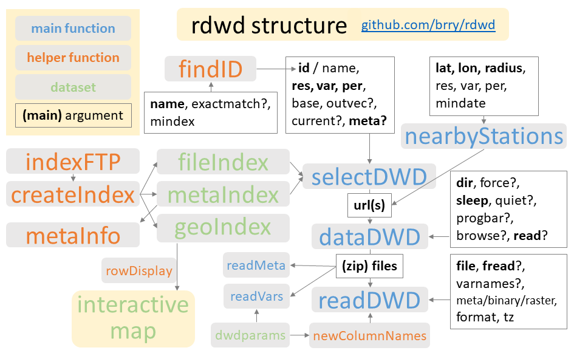

[Vignette Rmd source code](https://raw.githubusercontent.com/brry/rdwd/master/localtests/CreateVignettes/rdwd.Rmd)
(Not on CRAN to reduce load on DWD server through daily new builds and checks of the vignette)

[Interactive map vignette](mapDWD.html)


### Intro

The [R](https://www.r-project.org/) package [`rdwd`](https://github.com/brry/rdwd#rdwd)
contains code to select, download and read weather data from measuring stations across Germany. 
The German Weather Service (Deutscher Wetterdienst, DWD) provides 
over 228 thousand datasets with weather observations through the FTP server online at 

<ftp://ftp-cdc.dwd.de/pub/CDC/observations_germany/climate>.

For data interpolated onto a 1 km raster, including radar data up to the last hour, 
see <ftp://ftp-cdc.dwd.de/pub/CDC/grids_germany/>. 
Management of these (very large!) datasets is not yet included in rdwd.
If you want it to be supported, send me a message to boost it up my priority list.

For further details, please consult the 
[DWD FTP server documentation](ftp://ftp-cdc.dwd.de/pub/CDC/Readme_intro_CDC_ftp.pdf)


### Package structure

To use the observation datasets, `rdwd` has been designed to mainly do 3 things:

* [`selectDWD`](../help/selectDWD): facilitate file selection, e.g. for certain station names (with [`findID`](../help/findID)), 
by geographical location (see [map](mapDWD) and [`nearbyStations`](../help/nearbyStations)), by temporal resolution (**res** = 1/10 minutes, hourly, daily, monthly, annual), 
variables (**var** = temperature, rain, wind, sun, clouds, etc) or
observation period (**pre** = historical long term records or the current year)

* [`dataDWD`](../help/dataDWD): download a file (or multiple files, without getting banned by the FTP-server)

* [`readDWD`](../help/readDWD): read that data into R (including useful defaults for metadata)

[`selectDWD`](../help/selectDWD) uses the result from [`indexFTP`](../help/indexFTP) which recursively lists all the files on an FTP-server (using RCurl::getURL).
As this is time consuming, the result is stored in the package dataset [`fileIndex`](../help/fileIndex).
From this, [`metaIndex`](../help/metaIndex) and [`geoIndex`](../help/geoIndex) are derived.



[TOC](#top)


### Package installation

```{r install, eval=FALSE}
install.packages("rdwd")
# get the latest development version from github:
berryFunctions::instGit("brry/rdwd") 
# For full usage, as needed in indexFTP and metaDWD(..., current=TRUE):
install.packages("RCurl") # is only suggested, not mandatory dependency
```

On Linux, instead of the last line above, use in the terminal (with lowercase rcurl):
```
sudo apt-get install r-cran-rcurl
```

If direct installation from CRAN doesn't work, your R version might be too old. 
In that case it is really recommendable to [update R](https://github.com/brry/course#install). 
If you can't update R, try installing from source (github) via `instGit` as mentioned above. 
If that's not possible either, you might be able to `source` some functions from the 
[package zip folder](https://github.com/brry/rdwd/archive/master.zip)
```R
Vectorize(source)(dir("path/you_unzipped_to/rdwd-master/R", full=T))
```

[TOC](#top)


### Basic usage

```{r basics, eval=TRUE}
library(rdwd)
link <- selectDWD("Potsdam", res="daily", var="kl", per="recent")
file <- dataDWD(link, read=FALSE, dir=tempdir(), quiet=TRUE)
# tempdir is only for CRAN vignette checks. In real life, use a real folder.
clim <- readDWD(file)

str(clim)
```
[TOC](#top)


### Plotting examples

Recent temperature time series:
```{r plot, eval=TRUE, fig.height=3, fig.width=7}
par(mar=c(4,4,2,0.5), mgp=c(2.7, 0.8, 0), cex=0.8)
plot(clim[,c(2,4)], type="l", xaxt="n", las=1, main="Daily temp Potsdam")
berryFunctions::monthAxis(ym=TRUE)   ;   abline(h=0)
mtext("Source: Deutscher Wetterdienst", adj=-0.1, line=0.5, font=3)
```

Long term climate graph:
```{r climgraph, eval=TRUE, fig.height=3, fig.width=7, echo=-1}
par(mar=c(4,4,2,0.5), mgp=c(2.7, 0.8, 0), cex=0.8)
link <- selectDWD("Goettingen", res="monthly", var="kl", per="h")
clim <- dataDWD(link, quiet=TRUE)
clim$month <- substr(clim$MESS_DATUM_BEGINN,5,6)
temp <- tapply(clim$MO_TT, clim$month, mean, na.rm=TRUE)
prec <- tapply(clim$MO_RR, clim$month, mean, na.rm=TRUE)
library(berryFunctions)
headtail(clim[!is.na(clim$MO_TT)&!is.na(clim$MO_RR),])
# as of 2018-03, there are mostly NAs in MO_RR in many stations.
# A message has been sent to DWD.
climateGraph(temp, prec, main="Goettingen 1857:1946")
mtext("Source: Deutscher Wetterdienst", adj=-0.05, line=2.8, font=3)
```


[TOC](#top)


### Station selection

Weather stations can be selected geographically with the [interactive map](mapDWD.html).
All stations within a certain radius around a given lat-long position can be obtained with
[nearbyStations](../help/nearbyStations).

The DWD station IDs can be obtained from station names with
```{r findID, eval=TRUE}
findID("Potsdam")
findID("Koeln", exactmatch=FALSE)
```

[TOC](#top)


### Available files

File selection by station name/id and folder happens with [`selectDWD`](../help/selectDWD).
It needs an index of all the available files on the server.
The package contains such an index ([`fileIndex`](../help/fileIndex)) that is updated (at least) with each CRAN release of the package.
The [selectDWD documentation](../help/selectDWD) contains an overview of the FTP folder structure.

<!-- ```{r fileIndex, eval=TRUE} -->
<!-- head(rdwd:::fileIndex) # 28'798 rows in Jan 2017 (with some almost duplicate files) -->
<!-- ``` -->
If you find the file index to be outdated (Error in download.file ... : cannot open URL),
please let me know and I will update it. Meanwhile, use current=TRUE in [`selectDWD`](../help/selectDWD):

```{r files, eval=FALSE}
# all files at a given path, with current file index (RCurl required):
links <- selectDWD(res="monthly", var="more_precip", per="hist", current=TRUE)
```

[`fileIndex`](../help/fileIndex) is created with the function [`indexFTP`](../help/indexFTP) used in the last section of 
[rdwd-package.R](https://github.com/brry/rdwd/blob/master/R/rdwd-package.R#L208).

```{r listfiles, eval=FALSE}
# recursively list files on the FTP-server:
files <- indexFTP("hourly/sun") # use dir="some_path" to save the output elsewhere
berryFunctions::headtail(files, 5, na=TRUE)

# indexFTP uses a folder for resumed indexing after getting banned:
gridindex <- indexFTP("radolan","ftp://ftp-cdc.dwd.de/pub/CDC/grids_germany/hourly")
gridindex <- indexFTP(gridindex,"ftp://ftp-cdc.dwd.de/pub/CDC/grids_germany/hourly", sleep=1)

# with other FTP servers, this should also work...
funet <- indexFTP(base="ftp.funet.fi/pub/standards/w3/TR/xhtml11/", folder="")
p <- RCurl::getURL("ftp.funet.fi/pub/standards/w3/TR/xhtml11/",
                       verbose=T, ftp.use.epsv=TRUE, dirlistonly=TRUE)
```

[TOC](#top)


### File selection

[`selectDWD`](../help/selectDWD) is designed to be very flexible:

```{r select1, eval=FALSE, echo=TRUE}
# inputs can be vectorized, and period can be abbreviated:
selectDWD(c("Potsdam","Wuerzburg"), res="hourly", var="sun", per="hist")
```

```{r select2, eval=TRUE, echo=FALSE}
lapply(selectDWD(c("Potsdam","Wuerzburg"), res="hourly", var="sun", per="hist"), function(x) gsub("ical/", "ical/ ", x))
```

```{r select3, eval=FALSE, echo=TRUE}
# Time period can be doubled to get both filenames:
selectDWD("Potsdam", res="daily", var="kl", per="rh", outvec=TRUE)
```

```{r select4, eval=TRUE, echo=FALSE}
gsub("/tages", "/ tages", selectDWD("Potsdam", res="daily", var="kl", per="rh", outvec=TRUE))
```

There may be a differing number of available files for several stations across all folders.
That's why the default outvec is FALSE.

```{r select5, eval=TRUE}
lapply(selectDWD(id=c(3467,5116)), substr, 58, 1e4)
```

[TOC](#top)


### Metadata

[`selectDWD`](../help/selectDWD) also uses a complete data.frame with meta information,
[`metaIndex`](../help/metaIndex) 
(derived from the "Beschreibung" files in [`fileIndex`](../help/fileIndex)).
```{r meta23, eval=TRUE}
# All metadata at all folders:
data(metaIndex)
str(metaIndex, vec.len=2)
```
```{r metaView, eval=FALSE}
View(data.frame(sort(unique(rdwd:::metaIndex$Stationsname)))) # ca 6k entries
```

[`dataDWD`](../help/dataDWD) can download (and [`readDWD`](../help/readDWD) can correctly read) such a data.frame from any folder on the FTP server:
```{r meta1, eval=TRUE}
# file with station metadata for a given path:
m_link <- selectDWD(res="monthly", var="more_precip", per="hist", meta=TRUE)
substr(m_link, 50, 1e4) # (Monatswerte = monthly values, Beschreibung = description)
```
```{r meta2, eval=FALSE}
meta_monthly_rain <- dataDWD(m_link, dir=tdir) # not executed in vignette creation
str(meta_monthly_rain)
```

Meta files may list stations for which there are actually no files.
For example: Tucheim (5116) is listed in the metadata at
[.../monthly/more_precip/recent/RR_Monatwerte_Beschreibung_Stationen.txt](ftp://ftp-cdc.dwd.de/pub/CDC/observations_germany/climate/monthly/more_precip/recent/RR_Monatswerte_Beschreibung_Stationen.txt),
but actually has no file in that folder (only in .../monthly/more_precip/__historical__).
These refer to nonpublic datasets (The DWD cannot publish all datasets because of copyright restrictions).
To request those, please contact <klima.vertrieb@dwd.de>.


[TOC](#top)

Any feedback on this package (or this vignette) is very welcome via [github](https://github.com/brry/rdwd) or <berry-b@gmx.de>!
