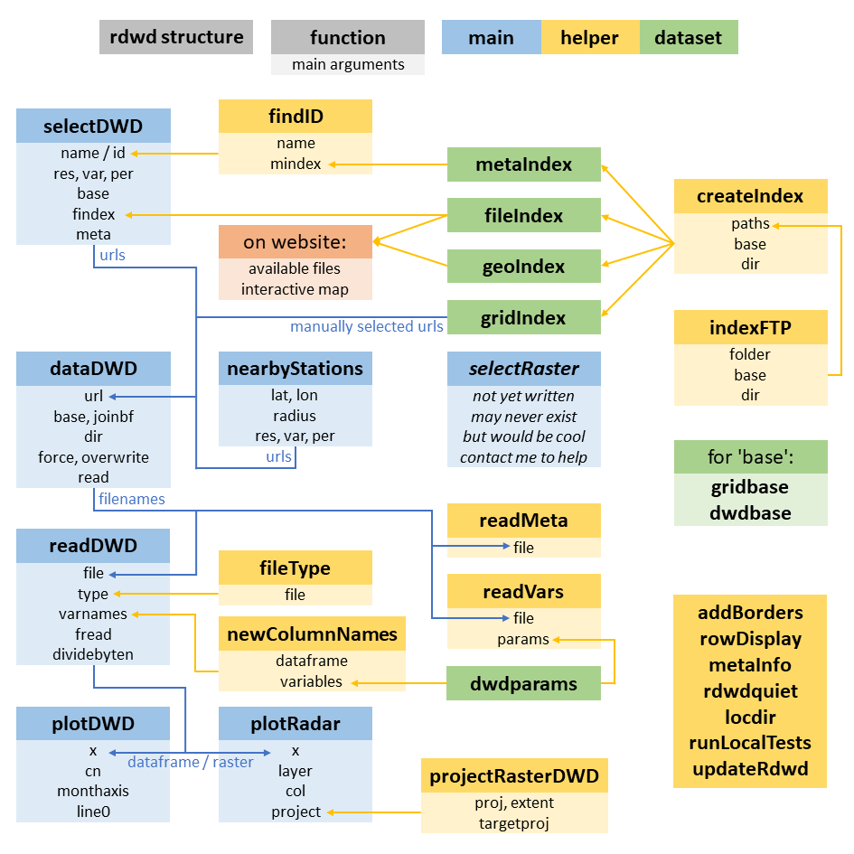

# Intro

`rdwd` is an R package to handle data from the German Weather Service (DWD).

This website has 3 main sections:

* time series from meteorological stations (chapters 3-7)
* raster data from radar + interpolation (chapter 8)
* use cases, i.e. extended usage examples (chapter 9-end)

Important links:

* further details on the data: [DWD FTP server documentation](https://opendata.dwd.de/climate_environment/CDC/Readme_intro_CDC_ftp.pdf)
* website [source code and files](https://github.com/brry/rdwd/tree/master/misc/vign)
* feedback is very welcome via [github](https://github.com/brry/rdwd) or [berry-b@gmx.de](mailto:berry-b@gmx.de)!  
* app for [comparing weather periods](https://brry.shinyapps.io/wetter/)

```{r globalquiet, echo=FALSE}
library(rdwd) # not sure why this is needed to  actually make it quiet...
options(rdwdquiet=TRUE)
# This should suppress all progress and info messages in the website output
# while not suggesting users to copypaste with explicit quiet=TRUE all the time.
# Especially new users should see the messages and progress bars, I think
```


*The remainder of this intro chapter is a copy of the [github README file](https://github.com/brry/rdwd#rdwd).*

----

```{r readmecontent, echo=FALSE, message=FALSE, results='asis'}
# mirror section of README
reme <- readLines('../../README.md')
doc <- grep("## Documentation", reme) + 0:4
reme <- gsub("###", "##", reme)
cat(reme[-c(1,doc)], sep='\n')
```

```{r helplink_macro, echo=FALSE}
helplink <- function(doc, topic=doc) paste0("[`",doc,"`](https://www.rdocumentation.org/packages/rdwd/topics/",topic,"){target=\"_blank\"}")
```

```{r lib_rdwd, echo=FALSE}
library(rdwd)
print_short <- function(x) 
  {out <- lapply(x, gsub, pattern=dwdbase, replacement="---")
  if(is.list(x)) out else unlist(out)}
```


# Package structure

`rdwd` is designed around 6 main functions:

* `r helplink("selectDWD")`: select time series data, needing:
  * station id or name, see chapters [interactive map](interactive-map.html) and [station selection](station-selection.html)
  * **res/var/per**, see available options in chapter [available datasets](available-datasets.html)
    * temporal resolution (**res** = 1/10 minutes, hourly, daily, monthly, annual)
    * variables (**var** = temperature, rain, wind, sun, clouds, etc)
    * observation period (**per** = historical long term records or the current year)
  * index of files on the FTP server (`r helplink("fileIndex", "index")`), see chapter [fileIndex](fileindex.html)  
&nbsp;

* `r helplink("nearbyStations")`: alternative to `selectDWD` for a given lat/lon location 

* raster data must be selected manually.

* `r helplink("dataDWD")`: download a file (or multiple files), without re-downloads for existing files

* `r helplink("readDWD")`: read that data into R (handling all the various file formats)

* `r helplink("plotDWD")`: plot time series

* `r helplink("plotRadar")`: visualize all raster data types nicely on a projected map  




# Interactive map

The `rdwd` package provides a collection of all the metafiles on the 
[DWD data server](https://opendata.dwd.de/climate_environment/CDC/observations_germany/climate).
It is presented as an interactive map below.

When a point is clicked, an infobox should appear.
The first line can be copypasted into R to obtain more information on the available files.
The map is created with the following code:

```{r map, fig.height=7, fig.width=7, warning=FALSE, eval=-1, screenshot.force=FALSE}
rdwd::updateRdwd() # for the latest version
library(rdwd)  ;  data(geoIndex)  ;  library(leaflet)
leaflet(geoIndex) %>% addTiles() %>%
        addCircles(~lon, ~lat, radius=900, stroke=F, color=~col) %>%
        addCircleMarkers(~lon, ~lat, popup=~display, stroke=F, color=~col)
```

The blue dots mark stations for which recent files are available 
(with >=1 file in 'recent' folder or 'BIS_DATUM' later than one year ago).
The red dots mark all stations with only historical datasets.

To see only the stations with recent data, use the following code:

```{r onlyrecent, eval=FALSE}
library(rdwd)  ;  data(geoIndex)  ;  library(leaflet) 
leaflet(data=geoIndex[geoIndex$recentfile,]) %>% addTiles() %>%
        addCircleMarkers(~lon, ~lat, popup=~display, stroke=F)
```

To request the nonpublic datasets counted in the infobox, please contact <cdc.daten@dwd.de> or <klima.vertrieb@dwd.de>.
(The DWD cannot publish all datasets because of copyright restrictions).

Note: `r helplink("geoIndex", "index")` is created using `r helplink("createIndex")` in
[`updateIndexes`](https://github.com/brry/rdwd/blob/master/R/updateIndexes.R).

See also: interactive app to [compare the weather](https://brry.shinyapps.io/wetter/) of a certain time period across years, run locally with `rdwd::app()`.


# Available datasets

*overview of the FTP folder structure*

The following folders in **`res/var/per`** notation (resolution/variable/period) are available at
[`dwdbase`](https://opendata.dwd.de/climate_environment/CDC/observations_germany/climate).

Here's a full example URL, for a file at hourly/wind/recent:
[ftp://opendata.dwd.de/climate_environment/CDC/observations_germany/climate/hourly/wind/recent/stundenwerte_FF_00164_akt.zip](https://opendata.dwd.de/climate_environment/CDC/observations_germany/climate/hourly/wind/recent/stundenwerte_FF_00164_akt.zip)

"<" signifies a split into the folders `per` = "recent" and "historical".  
"<<" signifies a split into the folders `per` = "now", "recent", "historical" and "meta_data".  
"-" signifies that there are no further sub-folders.  
"+" signifies another structure of subfolders.  
The symbols are clickable URLS leading to the corresponding **`res/var/`** FTP folder.  

Please note:

* both "solar" (-/<<) and "sun" (<) are available!  
* `1_minute/precipitation/historical` has a subfolder for each year.  
* `subdaily/standard_format` does not actually split in subfolders, but has recent/hist information in `fileIndex`.

* internally, `rdwd` uses ftp://opendata.dwd.de URLS, but web browsers no longer support FTP, so the documentation links to the https variant.

```{r ftp_folders_1, echo=FALSE}
library(magrittr)
suppressWarnings(suppressPackageStartupMessages(library(huxtable)))
options(huxtable.bookdown = FALSE) # no captions on tables
f <- readODS::read_ods("FTP_folders.ods", sheet="folders", col_types=NA, as_tibble=FALSE)
colnames(f)[1:4] <- c( "res= (columns)","1_minute","5_minutes","10_minutes")
fu <- f # f with urls
for(i in 2:ncol(f)) fu[-1,i] <- ifelse(f[-1,i]=="", " ", 
    paste0('<a href="',sub("ftp:","https:",dwdbase),'/',colnames(f)[i],'/',f[-1,1],'" target="_blank">',f[-1,i],'</a>'))
n <- which(fu$`res= (columns)`=="RES")
fu[n,-1] <- colnames(fu)[-1]
n <- n+1 # in the huxtable
ht <- huxtable::hux(fu, add_colnames=TRUE)
ht %>%
  # set_label("") %>% 
  set_background_color(value="white") %>% 
  set_background_color(3:nrow(ht), 2:ncol(ht), value="gray95") %>% 
  set_all_borders(1) %>%
  # set_bottom_border(1, everywhere, 2) %>%
  set_bold(1, -1, TRUE) %>% 
  set_bold(n, -1, TRUE) %>% 
  set_rotation(1, -1, 90) %>%
  set_rotation(n, -1, 90) %>%
  set_align(everywhere, -1, "center") %>% 
  set_valign(row=1, col=1, "bottom") %>% 
  map_background_color(by_values(" "="white")) %>% 
  set_position("center") %>% 
  set_escape_contents(value=FALSE)
detach("package:huxtable", unload=TRUE) # to suppress further autoformatting of tables
# fails, but whatever - looks nice. 
# Note: date2-date1 needs as.numeric, otherwise huxtable fails with error about
# assert_that not being available in chunk uc_berlinstationselection
```

```{r ftp_folders_missing, echo=FALSE}
library(rdwd)
data("fileIndex")
# online and table folder comparison
on <- paste(fileIndex$res, fileIndex$var, fileIndex$per, sep="/")
on <- unique(on)
on <- on[!grepl("timeseries_overview$", on)]
on <- on[!grepl("/ $", on)]

tab <- lapply(colnames(f)[-1], function(r) 
  {
  if(r=="multi_annual") return(paste0(r,"//",f[f[,r]=="-",1]))
  per4 <- c("now", "recent", "historical", "meta_data")
  per2 <- c("recent", "historical")
  r0 <- f[,r]=="-"
  r2 <- f[,r]=="<"
  r4 <- f[,r]=="<<"
  rv0 <- paste0(r,"/", f[r0, 1], "/")
  rv2 <- paste0(r,"/", f[r2, 1], "/")
  rv4 <- paste0(r,"/", f[r4, 1], "/")
  rv0 <- if(any(r0)) rv0 else ""[0]
  rv2 <- if(any(r2)) paste0(rep(rv2, each=length(per2)), per2) else ""[0]
  rv4 <- if(any(r4)) paste0(rep(rv4, each=length(per4)), per4) else ""[0]
  c(rv0,rv2,rv4)
  })
tab <- unlist(tab)

miss <- on[!on %in% tab]
miss <- miss[! miss %in% c("subdaily/standard_format/recent", "subdaily/standard_format/historical",
                           "annual/climate_indices/kl", "annual/climate_indices/precip", 
                           "monthly/climate_indices/kl", "monthly/climate_indices/precip",
                           "annual/climate_indices/historical", "annual/climate_indices/recent", 
                           "monthly/climate_indices/historical", "monthly/climate_indices/recent"
                           )]
l <- length(miss)
if(l>0) stop("\n\nThe following ", l, " FTP folders must yet be added to the ",
             "table (FTP_folder.ods) in section 'Available datasets':\n", 
             paste(miss, collapse="\n"))
miss <- tab[!tab %in% on]
l <- length(miss)
if(l>0) stop("\n\nThe following ", l, " table entries in section 'Available datasets' (from FTP_folder.ods)",
             " are no longer in the FTP folder:\n", paste(miss, collapse="\n"))
```


# Station selection

*`print_short` in this chapter is just a helper function to replace [dwdbase](https://opendata.dwd.de/climate_environment/CDC/observations_germany/climate) with `---` for shorter output.*

## by location

Weather stations can be selected geographically with the [interactive map](interactive-map.html).
All stations within a certain radius around a given lat-long position can be obtained with
`r helplink("nearbyStations")`.

## by ID

The DWD station IDs can be obtained from station names with `r helplink("findID")`:
```{r findID, eval=TRUE}
findID("Potsdam")
findID("Koeln", exactmatch=FALSE)
```

## by name

File selection by station name/id and folder can happen directly with `r helplink("selectDWD")`.
It is designed to be very flexible:

```{r select1, eval=FALSE, echo=TRUE}
# inputs can be vectorized, and period can be abbreviated:
selectDWD(c("Potsdam","Wuerzburg"), res="hourly", var="sun", per="hist") %>% print_short
```

```{r select2, eval=TRUE, echo=FALSE}
selectDWD(c("Potsdam","Wuerzburg"), res="hourly", var="sun", per="hist") %>% print_short
```
If res/var/per are left NA, an interactive selection is opened with the 
[available folder options](available-datasets.html) for the given station.

The time period can be doubled to get both filenames:
```{r select3}
selectDWD("Potsdam", res="daily", var="kl", per="rh") %>% print_short
```

There may be a differing number of available files for several stations across all folders.

```{r select5, eval=TRUE}
selectDWD(id=c(3467,5116), res="",var="",per="") %>% print_short
```

Since version 1.3.26 (2020-07-20), `SelectDWD` collects warnings from the loop into a single message:
```{r select6, eval=TRUE, echo=-1}
options(warn=0)
# out of 43 stations with a partial match for the name "Berlin", only 20 have data in the folowing folder
bd <- selectDWD("Berlin", exactmatch=FALSE, res="monthly", var="kl", per="h", quiet=FALSE)
str(  print_short(bd[bd!=dwdbase])  )
```


# fileIndex

If you find the `r helplink("fileIndex", "index")` to be outdated ("download.file errors: [...]  cannot open URL"), run  
`r helplink("rdwd::updateRdwd()", "updateRdwd")`  
If the issue persists, please let me [know](mailto:berry-b@gmx.de) and I will update it.  
Meanwhile, either use current=TRUE in `r helplink("selectDWD")`:

```{r files, eval=FALSE}
# all files at a given path, with current file index (RCurl required):
links <- selectDWD(res="monthly", var="more_precip", per="hist", current=TRUE)
```

or, for repetitive usage, create your own file index (for a certain subfolder):  
  
```{r listfiles, eval=FALSE}
# recursively list files on the FTP-server:
files <- indexFTP("hourly/sun") # use dir="some_path" to save the output elsewhere
berryFunctions::headtail(files, 5, na=TRUE)
# create and use a personal file index:
cursun <- createIndex(files)
head(cursun)
sunlink <- selectDWD("Potsdam", res="hourly", var="sun", per="r", findex=cursun)
```

## check for updates by the DWD

Since 2025, it is easy to check if I need to run `rdwd:::updateIndexes()` with:
```{r, checkUpdates, eval=FALSE}
checkUpdates()
```

## ftp

If the reason for the error lies in FTP being blocked on your system, use something like:
```{r remove_ftp, eval=FALSE}
link <- selectDWD("Potsdam","annual","kl","r")
kl <- dataDWD(link, base=sub("^ftp://","",dwdbase))
```

## background

`r helplink("indexFTP")` recursively lists all the files on an FTP-server (using `RCurl::getURL`).  
From those paths, `r helplink("createIndex")` generates `r helplink("fileIndex", "index")` and `r helplink("gridIndex", "index")`.
It also downloads all (ca 84) description files with metadata and creates `r helplink("metaIndex", "index")` and `r helplink("geoIndex", "index")`.  
All indexes are updated irregularly with the internal function [`updateIndexes`](https://github.com/brry/rdwd/blob/master/R/updateIndexes.R).

`r helplink("selectDWD")` helps to query the `fileIndex`.

The DWD often (but irregularly) updates or expands datasets, at which point the filenames in historical folders change.  
I check this with `r helplink("checkUpdates")`, fairly often around April-May when the historical files of active stations are updated with last year's data.

indexFTP can also access other servers:
```{r indexotherftp, eval=FALSE}
funet <- indexFTP(base="ftp.funet.fi/pub/standards/w3/TR/xhtml11/", folder="")
p <- RCurl::getURL(    "ftp.funet.fi/pub/standards/w3/TR/xhtml11/",
                       verbose=TRUE, ftp.use.epsv=TRUE, dirlistonly=TRUE)
```

## metaIndex

`r helplink("selectDWD")` also uses a complete data.frame with meta information,
`r helplink("metaIndex", "index")` 
(derived from the "Beschreibung" files in `r helplink("fileIndex", "index")`).
```{r meta23, eval=TRUE}
# All metadata at all folders:
data(metaIndex)
str(metaIndex, vec.len=2)
```
```{r metaView, eval=FALSE}
View(data.frame(sort(unique(rdwd:::metaIndex$Stationsname)))) # ca 6k entries
```

`r helplink("readDWD")` can correctly read such a data.frame from any folder on the FTP server:
```{r meta1, eval=TRUE}
# file with station metadata for a given path:
m_link <- selectDWD(res="monthly", var="more_precip", per="hist", meta=TRUE)
m_link <- grep(".txt$", m_link, value=TRUE)
print_short(m_link) # (Monatswerte = monthly values, Beschreibung = description)
```
```{r meta2}
meta_monthly_rain <- dataDWD(m_link)
str(meta_monthly_rain)
```

Meta files may list stations for which there are actually no files.
These refer to nonpublic datasets (The DWD cannot publish all datasets because of copyright restrictions).
To request those, please contact <cdc.daten@dwd.de> or <klima.vertrieb@dwd.de>.

The from and to dates do not always reflect the real time period with avalaible data.
They are read from the DWD `_Beschreibung_Stationen.txt` files, e.g. [this one](https://opendata.dwd.de/climate_environment/CDC/observations_germany/climate/daily/kl/historical/KL_Tageswerte_Beschreibung_Stationen.txt), see also [issue 32](https://github.com/brry/rdwd/issues/32).

For up-to-date metaIndexes, check for updates in the development version (`r helplink("rdwd::updateRdwd()", "updateRdwd")`), [prompt](mailto:berry-b@gmx.de) me to update it, or use your own version:
```{r mindexupdate}
ll <- selectDWD("", c("hourly","daily"), c("wind","kl"), "r", meta=TRUE)
ll <- grep(".txt$", ll, value=TRUE)
ll <- ll[!grepl("mn4",ll)]
ll <- sub(dwdbase, "", ll)
ll
ind <- createIndex(ll, dir=tempdir(), meta=TRUE, checkwarn=FALSE)
ind$metaIndex$hasfile <- TRUE
metaInfo(3987, mindex=ind$metaIndex)
```


# fread

`r helplink("readDWD")` has the argument `fread` to read datasets through `data.table::fread`.  
This is significantly faster than base `unzip + read.table`, especially for large historical files.  
The default is `fread=NA`, which checks for availability of the R package `data.table` and the system command `unzip`. 

## windows unzip

On Windows, the system command `unzip` is not available by default, only through e.g. a git shell or Rtools ([source](https://salesforce.stackexchange.com/questions/257846/unzip-is-not-recognized-as-an-internal-or-external-command)).  
If needed, **install [Rtools](https://cran.r-project.org/bin/windows/Rtools)** _(directly at C:/Rtools since compiler paths may not have spaces, as there would be with C:/Program Files/R/Rtools/)_.  

You might then need to add something like `C:/rtools40/usr/bin` to PATH, e.g. with the R code
```{r rtoolspath, eval=FALSE}
cat('PATH="${RTOOLS40_HOME}\\usr\\bin;${PATH}"', file="~/.Renviron", append=TRUE)
```
and then restart R (CTRL + SHIFT + F10 should suffice).

Check the availability of `unzip` with
```{r unziploc, eval=FALSE}
Sys.which("unzip") # gives me c:\\Rtools\\bin\\unzip.exe
```

Note that github user [Mightynasty](https://github.com/brry/rdwd/issues/23#issuecomment-679871841) did not get `unzip` in Rtools to work correctly.

For more background information, see rdwd issues [22](https://github.com/brry/rdwd/issues/22), [23](https://github.com/brry/rdwd/issues/23) and [24](https://github.com/brry/rdwd/issues/24).

## alternative

In case you do not need fast reading and don't want the warning about unzip, simply use `readDWD("file.zip", fread=FALSE)`.

## error messages

The following error messages have been reported to me.

[pfile] is the produkt file, e.g. _produkt_klima_tag_19370101_19860630_00001.txt_ for  
[path] _DWDdata/daily_kl_historical_tageswerte_KL_00001_19370101_19860630_hist.zip_   

**'unzip' is not recognized as an internal or external command, operable program or batch file**.  
`'(unzip -p [path].zip [pfile].txt) > [Rtempfile]'` **execution failed with error code 1**  
File '[Rtempfile]' has size 0. Returning a NULL data.frame. File contains no rows: [path].zip

**Error in data.table::fread**(paste("unzip -p", f, fp), na.strings = na9(), :  **File is empty: [Rtempfile]**  
In addition: Warning messages:  
1: **running command** `'C:\Windows\system32\cmd.exe /c (unzip -p [path].zip [pfile].txt) > [Rtempfile]` **had status 1**  
2: In `shell(paste("(", input, ") > ", tt, sep = "")) : '(unzip -p [path].zip [pfile].txt) > [Rtempfile]'` **execution failed with error code 1**

Der Befehl "unzip" ist entweder falsch geschrieben oder konnte nicht gefunden werden.  
The command "unzip" is either misspelled or could not be found.


# Raster data

For observational data at `r helplink("dwdbase")`, 
`r helplink("selectDWD")` is the main function to choose data to be downloaded.

For gridded data at [`gridbase`](https://opendata.dwd.de/climate_environment/CDC/grids_germany), including 
data interpolated onto a 1 km raster and radar data up to the last hour, 
I don't yet understand the structure of the FTP server as well.  
For now, you'll have to query `r helplink("gridIndex", "index")` yourself, e.g. with
```{r, gridIndex, eval=FALSE}
data(gridIndex)
head(grep("historical", gridIndex, value=TRUE))

# currently available files in a given folder:
rasterbase <- paste0(gridbase,"/seasonal/air_temperature_mean")
ftp.files <- indexFTP("/16_DJF", base=rasterbase, dir=tempdir())

# current index of all grid files (takes > 2 min, yields >30k charstrings >5MB):
gridIndexNow <- indexFTP(base=gridbase, filename="grids")
```
If you send me examples of how you use it, I can then expand this in `rdwd`.  
For files that are not yet read correctly, you can also consult the 
Kompositformatbeschreibung at <https://www.dwd.de/DE/leistungen/radolan/radolan.html>

Besides at `r helplink("dwdbase")` and `r helplink("gridbase", "dwdbase")`, 
there's yet more data at <https://opendata.dwd.de/weather>.

Before running the code below, update the package:
```{r updaterdwd_raster, eval=FALSE}
rdwd::updateRdwd()
```

The following overview will usually unzip only a few selected files for speed and memory considerations.
In real life, you probably do not want to unzip to a temporary `exdir`.
You can also remove `read=FALSE` in dataDWD and add the needed arguments right there, 
but I wanted to be explicit here.

The first line in each code block below shows for which FTP folder 
at [`gridbase`](https://opendata.dwd.de/climate_environment/CDC/grids_germany) 
this function will be called.  
The last line shows what projection and extent to use in `r helplink("plotRadar")`. 

## readDWD.raster
`r helplink("readDWD.raster")` - for actual code, see [use case: monthly gridded data](use-case-monthy-gridded-data.html)
```{r readDWD_raster, echo=-1}
par(mar=c(2,2,2.2,5), mgp=c(3,0.7,0))
link <- "seasonal/air_temperature_mean/16_DJF/grids_germany_seasonal_air_temp_mean_188216.asc.gz" # 0.2 MB
file <- dataDWD(link, base=gridbase, joinbf=TRUE, read=FALSE)
rad <- readDWD(file) # with dividebyten=TRUE
rad <- readDWD(file) # runs faster at second time due to skip=TRUE
plotRadar(rad, main=".raster", proj="seasonal", extent=NULL)
```


## readDWD.nc
`r helplink("readDWD.nc")`
```{r readDWD_nc, echo=-1}
par(mar=c(2,2,2.2,5), mgp=c(3,0.7,0))
link <- "daily/Project_TRY/pressure/PRED_199606_daymean.nc.gz"  #  5 MB
file <- dataDWD(link, base=gridbase, joinbf=TRUE, read=FALSE, force=T)
rad <- readDWD(file) # can also have interactive selection of variable
plotRadar(rad, main=".nc", proj="nc", extent="nc", layer=1)
```

## readDWD.binary (RW)
`r helplink("readDWD.binary")` - see also [use case: recent hourly radar files](use-case-recent-hourly-radar-files.html)
```{r readDWD_binary_rw, echo=-1}
par(mar=c(2,2,2.2,5), mgp=c(3,0.7,0))
link <- "hourly/radolan/reproc/2017_002/bin/2017/RW2017.002_201712.tar.gz"  # 25 MB
file <- dataDWD(link, base=gridbase, joinbf=TRUE, read=FALSE)
rad <- readDWD(file, exdir=tempdir(), selection=1:3)
plotRadar(rad$dat, main=".binary RW", extent="rw", layer=1)
```

## readDWD.binary (SF)
`r helplink("readDWD.binary")`  
```{r readDWD_binary_sf, echo=-1}
par(mar=c(2,2,2.2,5), mgp=c(3,0.7,0))
link <- "/daily/radolan/historical/bin/2017/SF201712.tar.gz"           # 204 MB
file <- dataDWD(link, base=gridbase, joinbf=TRUE, read=FALSE)
rad <- readDWD(file, exdir=tempdir(), selection=1:3) # with toraster=TRUE
plotRadar(rad$dat, main=".binary SF", layer=1)
```

## readDWD.asc
`r helplink("readDWD.asc")` 
```{r readDWD_asc, echo=-1}
par(mar=c(2,2,2.2,5), mgp=c(3,0.7,0))
link <- "hourly/radolan/historical/asc/2018/RW-201809.tar" # 25 mB
file <- dataDWD(link, base=gridbase, joinbf=TRUE, read=FALSE) # dbin -> mode=wb
rad <- readDWD(file, selection=1:3, dividebyten=TRUE)
plotRadar(rad, main=".asc", layer=1)
```
 
## readDWD.radar (RW)
`r helplink("readDWD.radar")` - for actual code for daily data, see [use case: daily radar files](use-case-daily-radar-files.html)
```{r readDWD_radar, echo=-(1:2)}
par(mar=c(2,2,2.2,5), mgp=c(3,0.7,0))
suppressPackageStartupMessages(library(R.utils)) 
links <- indexFTP("hourly/radolan/recent/bin", base=gridbase, dir=tempdir()) # 0.04 MB
file <- dataDWD(links[773], base=gridbase, joinbf=TRUE, dir=tempdir(), read=FALSE)
rad <- readDWD(file)
plotRadar(rad$dat, main=".radar RW")
```

## readDWD.radar (RQ)
`r helplink("readDWD.radar")`
```{r readDWD_radar_RQ, echo=-1}
par(mar=c(2,2,2.2,5), mgp=c(3,0.7,0))
rqbase <- "ftp://opendata.dwd.de/weather/radar/radvor/rq"
links <- indexFTP("", base=rqbase, dir=tempdir()) # 0.07 MB
file <- dataDWD(links[17], base=rqbase, joinbf=TRUE, dir=tempdir(), read=FALSE)
rad <- readDWD(file)
plotRadar(rad$dat, main=".radar RQ")
```

## readDWD.grib2
`r helplink("readDWD.grib2")`
```{r readDWD_grib2, fig.width=6, fig.height=5, echo=-1}
par(mar=c(2,2,2.2,5), mgp=c(3,0.7,0))
nwpbase <- "ftp://opendata.dwd.de/weather/nwp/icon-d2/grib/00/t_2m"
links <- indexFTP("", base=nwpbase, dir=tempdir())
file <- dataDWD(links[6], base=nwpbase, joinbf=TRUE, dir=tempdir(), read=FALSE)
#forecast <- readDWD(file)
#plotRadar(forecast, main=".grib2", project=FALSE)
```
grib files are currently [broken](https://github.com/brry/rdwd/issues/28) (2021-04-08) but would look like this:


## binary file errors
Binary files must be downloaded by `download.file` with wb=TRUE (at least on Windows, due to CRLF issues).
`download.file` will automatically do that for some file endings (like .gz, .zip).
For others (e.g. .tar files in [readDWD.asc](https://bookdown.org/brry/rdwd/raster-data.html#readdwd.asc) 
or files at [weather/radar/radolan](https://opendata.dwd.de/weather/radar/radolan/rw/)),
`r helplink("dataDWD")` has a dbin=TRUE option. 
Since Version 1.4.18 (2021-04-08), the default is `dbin=TRUE`. Report errors [here](https://github.com/brry/rdwd/issues/20) if needed.
If you do not use this, your plots may look partially shifted like this and have the wrong units (image from 2020-06-16 21:30 CEST):
```{r wrong_binary, eval=FALSE}
url <- "ftp://opendata.dwd.de/weather/radar/radolan/rw/raa01-rw_10000-latest-dwd---bin"
rw_file <- dataDWD(url, read=FALSE, dbin=FALSE)
rw_orig <- dwdradar::readRadarFile(rw_file)
terra::plot(terra::rast(rw_orig$dat))
```


# see also

Here are some references related to weather data analysis. Expansion suggestions are very welcome via [github](https://github.com/brry/rdwd) or [berry-b@gmx.de](mailto:berry-b@gmx.de)!

R packages for weather data

- USA: [countyweather](https://www.rdocumentation.org/packages/countyweather),
       [rnoaa](https://docs.ropensci.org/rnoaa/)

- Canada: [weathercan](https://cran.r-project.org/package=weathercan)

- Netherlands: [KNMIr](https://github.com/bvhest/KNMIr)

- World: [GSODR](https://docs.ropensci.org/GSODR)

- France: [Blogpost, not package](https://r.iresmi.net/posts/2023/meteofrance/index.html)


Other resources

- UK data [website](https://www.metoffice.gov.uk/climate/uk/data)

- The Python equivalent of rdwd: the package [wetterdienst](https://github.com/earthobservations/wetterdienst) that also covers Radolan and Radvor and has local caching (even with an SQL interface), but has many dependencies. 
It accesses more data sources than rdwd and currently has a more active development community.

- the *Catchment Attributes and MEteorology for Large-sample Studies* initiative 
([CAMELS](https://zenodo.org/record/6517142)).


# - use case: recent time series

download & read data

```{r uc_recent_time_series_data, eval=TRUE, fig.height=3, fig.width=7, eval=-1}
rdwd::updateRdwd()
library(rdwd)
link <- selectDWD("Potsdam", res="daily", var="kl", per="recent")
clim <- dataDWD(link, force=NA, varnames=TRUE)
str(clim)
```

plot time series

```{r uc_recent_time_series_plot, eval=TRUE, fig.height=3, fig.width=7}
par(mar=c(4,4,2,0.5), mgp=c(2.7, 0.8, 0), cex=0.8)
plot(clim[,c(2,14)], type="l", xaxt="n", las=1, main="Daily temp Potsdam")
berryFunctions::monthAxis()   ;   abline(h=0)
mtext("Source: Deutscher Wetterdienst", adj=-0.1, line=0.5, font=3)
```


# - use case: long term climate graph

```{r uc_climgraph, eval=TRUE, fig.height=3, fig.width=7, echo=-1}
par(mar=c(4,4,2,0.5), mgp=c(2.7, 0.8, 0), cex=0.8)
rdwd::updateRdwd()
library(rdwd)
link <- selectDWD("Goettingen", res="monthly", var="kl", per="h")
clim <- dataDWD(link)

clim$month <- substr(clim$MESS_DATUM_BEGINN,5,6)
temp <- tapply(clim$MO_TT, clim$month, mean, na.rm=TRUE)
prec <- tapply(clim$MO_RR, clim$month, mean, na.rm=TRUE)

berryFunctions::climateGraph(temp, prec, main="Goettingen")
mtext("Source: Deutscher Wetterdienst", adj=-0.05, line=2.8, font=3)
```

See also the [app](https://brry.shinyapps.io/wetter/) to visualize the weather of a given time period, compared to the measurements of the same period in other years.  
This can also be run locally with `rdwd::app()`.

# - use case: merge historical and recent data

```{r uc_histrecent}
rdwd::updateRdwd()
library(rdwd)
links <- selectDWD("Potsdam", res="daily", var="kl", per="hr")
klima <- dataDWD(links, hr=4)
plot(TMK~MESS_DATUM, data=tail(klima,1500), type="l")

links <- selectDWD("Celle", res="daily", var="kl", per="hr")
klima <- dataDWD(links, hr=4, varnames=TRUE)
plotDWD(tail(klima,800), "PM.Luftdruck")
```

# - use case: vectorized data

I'ts always good to update before getting started:
```{r uc_vector_penomena1, eval=FALSE}
rdwd::updateRdwd()
library(rdwd)
```

Now we'll just specify some IDs we're interested in:
```{r uc_vector_penomena2}
ids <-  c(3988, 5559, 2456, 3034, 1964, 4549, 2950, 5419, 2641, 3565)
links <- selectDWD(id=ids, res="daily", var="weather_phenomena", per="h")
phen <- dataDWD(links)
names(phen) <- substr(names(phen), 54,58) # only IDs (not paths) as name
str(phen, max.level=1)
```

All further analysis can now be done on this named list.

# - use case: monthy gridded data

From the [monthly](https://opendata.dwd.de/climate_environment/CDC/grids_germany/monthly) 
folder at `r helplink("gridbase", "dwdbase")`, we want to
download .asc.gz files for selected years and open them in R for further processing.

```{r grid_monthly_index, message=FALSE}
rdwd::updateRdwd()
library(rdwd)
data("gridIndex")
index <- grep("monthly/precipitation", gridIndex, value=TRUE) # 1'709
index <- grep('2014|2015|2016',index, value=TRUE) # n=36 (3*12)

precip <- dataDWD(index[6:8], base=gridbase, joinbf=TRUE)
```
For .asc.gz files, `r helplink("readDWD")` calls `r helplink("readDWD.raster")`.
This runs faster if called a second time due to skip=TRUE in `gunzip`.  
Now we can project and visualize with:

```{r grid_monthly_vis}
plotRadar(precip[[1]], proj="seasonal", extent=NULL, main=names(precip)[1])
```

For further processing, we can create a terra raster from the list, which e.g. enables fast and easy indexing.
```{r grid_monthly_stack, eval=FALSE}
precip <- terra::rast(precip)
```
This is expanded upon in the next [use case](use-case-values-at-locations-in-grid.html).


A few projection references:

The [Beschreibung file](https://opendata.dwd.de/climate_environment/CDC/grids_germany/seasonal/air_temperature_max/BESCHREIBUNG_gridsgermany_seasonal_air_temperature_max_de.pdf)
leads to
<https://spatialreference.org/ref/epsg/31467/>
which is used internally in `r helplink("projectRasterDWD")`, currently at 
[line 70](https://github.com/brry/rdwd/blob/master/R/projectRasterDWD.R#L70).  


# - use case: values at locations in grid

Obtain time series of values at a selected location in gridded data.

```{r grid_loc_val_index}
rdwd::updateRdwd()
library(rdwd)
# select data
index <- indexFTP(folder="annual/air_temperature_max", base=gridbase)
index <- index[-(1:2)] # exclude description files
index <- index[as.numeric(substr(index,62,65))>=2013] # after year 2013
index
```

```{r grid_loc_val_downloadread}
# download & read data:
tempmax <- dataDWD(index, base=gridbase, joinbf=TRUE)
names(tempmax) <- substr(names(tempmax), 62, 65)
```

```{r grid_loc_val_project}
# visual data & projection check:
plotRadar(tempmax[[1]], proj="seasonal",extent="seasonal", 
          main="Annual grid of monthly averaged daily maximum air temperature (2m) - 2013")
```

```{r grid_loc_val_stack}
# terra raster:
tempmax_stack <- terra::rast(tempmax)
tempmax_stack <- projectRasterDWD(tempmax_stack, proj="seasonal",extent="seasonal")
tempmax_stack
terra::plot(tempmax_stack, range=range(terra::minmax(tempmax_stack)) )
```

```{r grid_loc_val_extract}
# Time series at given location:
loc <- data.frame(x=12.65295, y=53.06547) # Aussichtspunkt Kyritz-Ruppiner Heide
round(unlist(terra::extract(tempmax_stack, loc)[-1]),1)
```


# - use case: daily radar files
Update the package first:
```{r updatardwd_radar, eval=FALSE}
rdwd::updateRdwd()
library(rdwd)
```

rdwd::updateRdwd()
Download and read with `r helplink("readDWD.radar")` with `dividebyten=TRUE`:
```{r daily_radar_read}
# library("rdwd")
radbase <- paste0(gridbase,"/daily/radolan/recent/bin/")
radfile <- format(Sys.Date()-5, "raa01-sf_10000-%y%m%d1450-dwd---bin.gz")
rad <- dataDWD(radfile, base=radbase, joinbf=TRUE)
```
Project and then plot:
```{r daily_radar_plot}
radp <- projectRasterDWD(rad$dat)
plotRadar(radp, main=paste("mm in 24 hours preceding", rad$meta$date), project=FALSE)
```

Save the projected radar image as NCDF file, read back and plot (not executed):
```{r daily_radar_ncdf, eval=FALSE}
terra::writeCDF(radp, "rad_0714_2350.nc", overwrite=TRUE, 
                varname="pre", longname="precipitation24hrs", zname="nbands")

nc <- ncdf4::nc_open("rad_0714_2350.nc")
nc
pre <- ncdf4::ncvar_get(nc, "pre")
lon <- nc$dim$longitude$vals
lat <- nc$dim$latitude$vals
image(lon, rev(lat), pre[,ncol(pre):1]) # takes several seconds
rdwd::addBorders()
```


# - use case: recent hourly radar files
Single RW files at <https://opendata.dwd.de/weather/radar/radolan/rw> should be read
with the underlying [`readRadarFile`](https://www.rdocumentation.org/packages/dwdradar/topics/readRadarFile)
that has been outsourced to `dwdradar` to keep the basic `rdwd` as lean as possible.

Since these datasets only exist for two days on the FTP Server, I'm storing them in `tempdir()`.

Please note that for projecting (see `r helplink("projectRasterDWD")`), 
the radolan extent seems to be needed, not the rw extent.

```{r recent_radar}
rw_base <- "ftp://opendata.dwd.de/weather/radar/radolan/rw"
rw_urls <- indexFTP(base=rw_base, dir=tempdir(), folder="", exclude.latest.bin=TRUE)
rw_file <- dataDWD(rw_urls[15], base=rw_base, joinbf=TRUE, dir=tempdir(), read=FALSE)
rw_file_actual <- R.utils::bunzip2(rw_file) # zipped since between 2022-06 and 2023-04

rw_orig <- dwdradar::readRadarFile(rw_file_actual)
str(rw_orig)
# NB: this is an rw file, but needs radolan extent instead of rw
plotRadar(terra::rast(rw_orig$dat), extent="radolan", main=rw_orig$meta$date)
```


# - use case: longest time series in Berlin

## select station
Choose station in Berlin with longest monthly average recordings
(according to metadata, which is not always correct).
```{r uc_berlinstationselection}
rdwd::updateRdwd()
library(rdwd)
ids <- findID("Berlin", exactmatch=FALSE)
head(ids)
data("metaIndex")
berlin <- metaIndex[with(metaIndex, 
              Stations_id %in% ids & res=="monthly" & var=="kl" & per=="historical"),]
berlin$ndays <- as.numeric(berlin$bis_datum - berlin$von_datum)
berlin <- berryFunctions::sortDF(berlin, ndays)
berlin$von_datum <- as.character(berlin$von_datum) # avoid huxtable error
berlin$bis_datum <- as.character(berlin$bis_datum)
berlin # Dahlem (FU) has data since 1719 !
```

## download and inspect data
```{r uc_berlindata, fig.height=5, fig.width=7, echo=-1}
par(mar=c(2,2,0.2,0.2))
url <- selectDWD("Berlin-Dahlem (FU)", res="monthly", var="kl", per="h")
kl <- dataDWD(url, varnames=TRUE)
plot(kl$MESS_DATUM, kl$MO_TT.Lufttemperatur, type="l", las=1) # pretty complete
```

## aggregates by month
```{r uc_berlinmonthly, fig.height=5, fig.width=7, echo=-1}
par(mar=c(1.5, 3, 2, 0.2))
monthly <- tapply(kl$MO_TT.Lufttemperatur, format(kl$MESS_DATUM,"%m"), quantile, probs=0:10/10)
monthly <- sapply(monthly, I)

plot(1, type="n", xlim=c(1,12), ylim=range(monthly), xaxt="n", las=1, 
     xlab="Vis by Berry B, github.com/brry/rdwd", ylab="monthly temperature average",
     main="Temperature variation in Berlin is highest in winter")
axis(1, 2:12-0.5, labels=FALSE)
axis(1, 1:12, substr(month.abb,1,1), tick=FALSE, line=-0.5)
for(m in 1:12) for(q in 1:5) lines(c(m,m), monthly[c(q,12-q),m], lend=1, 
                                   col=berryFunctions::addAlpha("red",0.2), lwd=5)
for(m in 1:12) points(m, mean(monthly[,m]), pch=3)
```


# - use case: Rainfall intensity depends on temperature

Clausius-Clapeyron scaling holds even for very high temperatures, 
we just don't have enough data yet to have observed the expected extreme rainfall intensities.

If quantiles are estimated by appropriately fitting a GDP and using its quantiles,
extreme rainfall intensity estimates continue to rise with air temperature.


Code (with a much older version of `rdwd`, might not run out of the box any more):
<https://github.com/brry/prectemp/blob/master/Code_analysis.R>  
Publication:
<http://www.nat-hazards-earth-syst-sci-discuss.net/nhess-2016-183>

# - use case: Get all daily rainfall data 2014:2016

## get the URLS of data to be downloaded

```{r dailyrain_data_selection, warning=FALSE, eval=-1}
rdwd::updateRdwd()
library(rdwd)
links <- selectDWD(res="daily", var="more_precip", per="hist")
length(links) # ca 6k stations - would take very long to download

# select only the relevant files:
data("metaIndex")
myIndex <- metaIndex[
  metaIndex$von_datum < as.Date("2014-01-01") &
  metaIndex$bis_datum > as.Date("2016-12-31") & metaIndex$hasfile   ,  ]
data("fileIndex")    
links <- fileIndex[
  suppressWarnings(as.numeric(fileIndex$id)) %in% myIndex$Stations_id &
  fileIndex$res=="daily" &
  fileIndex$var=="more_precip" &
  fileIndex$per=="historical"         , "path" ]  

length(links) # ca 2k elements - much better
```


## download the data

If some downloads fail (mostly because you'll get kicked off the FTP server),
you can just run the same code again and only the missing files will be downloaded.

If you really want to download 2k historical (large!) datasets, 
you might need to set `sleep` in `r helplink("dataDWD")` to a relatively high value.

For speed, we'll only work with the first 3 urls.

```{r dailyrain_data_download, message=FALSE}
localfiles <- dataDWD(links[1:3], joinbf=TRUE, sleep=0.2, read=FALSE)
```


## read the data

2k large datasets probably is way too much for memory, so we'll use a custom reading function.
It will only select the relevant time section and rainfall column.
The latter will be named with the id extracted from the filename.

```{r dailyrain_reading_function, message=FALSE}
readVars(localfiles[1])[,-3] # we want the RS column

read2014_2016 <- function(file, fread=TRUE, quiet=TRUE, ...)
{
 out <- readDWD(file, fread=fread, quiet=quiet, ...)
 out <- out[out$MESS_DATUM >= as.Date("2014-01-01") & 
            out$MESS_DATUM <= as.Date("2016-12-31")    , ]
 out <- out[ , c("MESS_DATUM", "RS")]
 # Station id as column name:
 idstringloc <- unlist(gregexpr(pattern="tageswerte_RR_", file))
 idstring <- substring(file, idstringloc+14, idstringloc+18)
 colnames(out) <- c("date",  idstring)
 return(out)
}
str(read2014_2016(localfiles[1], quiet=FALSE)) # test looks good
```

Now let's apply this to all our files and merge the result.

```{r dailyrain_data_reading, message=FALSE}
rain_list <- pbapply::pblapply(localfiles, read2014_2016)
rain_df <- Reduce(function(...) merge(..., all=T), rain_list)
str(rain_df) # looks nice!
summary(rain_df) # 9 NAs in station 00006
```


## visual data checks

```{r dailyrain_vis, fig.height=3, fig.width=6}
plot(rain_df$date, rain_df[,2], type="n", ylim=range(rain_df[,-1], na.rm=T), 
     las=1, xaxt="n", xlab="Date", ylab="Daily rainfall sum  [mm]")
berryFunctions::monthAxis()
for(i in 2:ncol(rain_df)) lines(rain_df$date, rain_df[,i], col=sample(colours(), size=1))

plot(rain_df[,2:4]) # correlation plot only works for a few columns!
```

Let's see the locations of our stations in an interactive map.

```{r dailyrain_map_interactive, warning=FALSE, fig.height=3, fig.width=6}
data(geoIndex)  ;  library(leaflet) 
mygeoIndex <- geoIndex[geoIndex$id %in% as.numeric(colnames(rain_df)[-1]),]

leaflet(data=mygeoIndex) %>% addTiles() %>%
        addCircleMarkers(~lon, ~lat, popup=~display, stroke=T)
```    

For a static map with scaleBar, use [OSMscale](https://github.com/brry/OSMscale?tab=readme-ov-file#intro):

```{r dailyrain_map_static, message=FALSE, fig.height=2, fig.width=6, warning=FALSE}
library(OSMscale)
pointsMap("lat", "lon", mygeoIndex, fx=2, fy=1, pargs=list(lwd=3), 
                    col="blue", zoom=5)
```    


# - use case: plot all rainfall values around a given point

## Find meteo stations around a given point

```{r rainregion_nearbyStations, message=FALSE}
rdwd::updateRdwd()
library(rdwd)
m <- nearbyStations(49.211784, 9.812475, radius=30,
    res=c("daily","hourly"), var=c("precipitation","more_precip","kl"),
    mindate=as.Date("2016-05-30"), statname="Braunsbach catchment center")
# Remove duplicates. if kl and more_precip are both available, keep only more_precip:
library("berryFunctions")
m <- sortDF(m, "var")
m <- m[!duplicated(paste0(m$Stations_id, m$res)),]
m <- sortDF(m, "res")
m <- sortDF(m, "dist", decreasing=FALSE)
rownames(m) <- NULL
DT::datatable(m, options=list(pageLength=5, scrollX=TRUE))
```

Interactive map of just the meteo station locations:
```{r rainregion_interactive_map, message=FALSE, fig.height=3, fig.width=4}
library(leaflet)
m$col <- "red" ; m$col[1] <- "blue"
leaflet(m) %>% addTiles() %>%
  addCircles(lng=9.812475, lat=49.211784, radius=30e3) %>%
  addCircleMarkers(~geoLaenge, ~geoBreite, col=~col, popup=~Stationsname)
```

## Download and process data

Download and process data for the stations, get the rainfall sums of a particular day (Braunsbach flood May 2016):
```{r rainregion_download_data, message=FALSE, warning=FALSE}
prec <- dataDWD(m$url, fread=TRUE)
names(prec) <- m$Stations_id[-1]
prec29 <- sapply(prec[m$res[-1]=="daily"], function(x)
         {
         if(nrow(x)==0) return(NA)
         col <- "RS"
         if(!col %in% colnames(x)) col <- "R1"
         if(!col %in% colnames(x)) col <- "RSK"
         sel <- x$MESS_DATUM==as.Date("2016-05-29")
         if(!any(sel)) return(NA)
         x[sel, col]
         })
prec29 <- data.frame(Stations_id=names(prec29), precsum=unname(prec29))
prec29 <- merge(prec29, m[m$res=="daily",c(1,4:7,14)], sort=FALSE)
head(prec29[,-7]) # don't show url column with long urls
```

7 of the files contain no rows. readDWD warns about this (but the warnings are suppressed in this website).  
One example is daily/more_precip/historical/tageswerte_RR_07495_20070114_20181231_hist.zip

## Plot rainfall sum on map

For a quick look without a map, this works:
```{r rainregion_static_points, eval=FALSE}
plot(geoBreite~geoLaenge, data=m, asp=1)
textField(prec29$geoLaenge, prec29$geoBreite, prec29$precsum, col=2)
```

But it's nicer to have an actual map via [OSMscale](https://github.com/brry/OSMscale?tab=readme-ov-file#intro):
```{r rainregion_static_map, message=FALSE, fig.height=4.1, fig.width=4, warning=FALSE}
library(OSMscale)
map <- pointsMap(geoBreite,geoLaenge, data=m, type="osm", plot=FALSE)
pp <- projectPoints("geoBreite", "geoLaenge", data=prec29, to=map$tiles[[1]]$projection)
prec29 <- cbind(prec29,pp) ; rm(pp)
pointsMap(geoBreite,geoLaenge, data=m, map=map, scale=FALSE)
textField(prec29$x, prec29$y, round(prec29$precsum), font=2, cex=1.5)
scaleBar(map, cex=1.5, type="line", y=0.82)
title(main="Rainfall sum  2016-05-29  7AM-7AM  [mm]", line=-1)
```


# - use case: map climate data to Landkreise

Shapefile of Landkreis districts:  
<https://public.opendatasoft.com/explore/dataset/landkreise-in-germany/export/>
(file size 4 MB, unzipped 10 MB)

## find available meteo stations for each district

```{r climdistrict_data_selection, message=FALSE}
rdwd::updateRdwd()
library(rdwd)
# Select monthly climate data:
data("metaIndex") ; m <- metaIndex
m <- m[m$res=="monthly" & m$var=="kl" & m$per=="recent" & m$hasfile, ]
# Transform into spatial object:
msf <- sf::st_as_sf(m, coords=c("geoLaenge", "geoBreite"), crs=4326)

# Read district shapefile, see link above:
lk <- sf::st_read("landkreise-in-germany.shp", quiet=TRUE)

# intersections: list with msf rownumbers for each district:
int <- sf::st_intersects(lk, msf)
```

<https://gis.stackexchange.com/a/318629/36710>

```{r climdistrict_plot, fig.height=5}
# plot to check projection:
plot(lk[,"id_2"], reset=FALSE)
colPoints("geoLaenge", "geoBreite", "Stationshoehe", data=m, add=T, legend=F)
# berryFunctions::colPointsLegend + sf plots = set margins, see note there!
axis(1, line=-1); axis(2, line=-1, las=1)
points(m[int[[2]], c("geoLaenge", "geoBreite")], pch=16, col=2, cex=1.8)
```


## Average data per district

Running analysis for a few selected districts only to reduce computation time.  
Monthly rainfall average per Landkreis.
```{r climdistrict_data_download}
landkreis_rain <- function(lki) # LandKreisIndex (row number in lk)
{
rnr <- int[[lki]] # msf row number
if(length(rnr)<1)
  {
  warning("No rainfall data available for Landkreis ", lki, ": ", lk$name_2[lki], call.=FALSE)
  out <- data.frame(NA,NA)[FALSE,]
  colnames(out) <- c("MESS_DATUM", as.character(lk$name_2[lki]))
  return(out)
  }
urls <- selectDWD(id=m[rnr, "Stations_id"], res="monthly", var="kl", per="r")
clims <- dataDWD(urls, varnames=FALSE)
if(length(urls)==1) 
  {rainmean <- clims$MO_RR 
  monthlyrain <- clims[c("MESS_DATUM", "MO_RR")]
  } else
{
monthlyrain <- lapply(seq_along(clims), function(n) 
 {
 out <- clims[[n]][c("MESS_DATUM", "MO_RR")]
 colnames(out)[2] <- names(clims)[n] # no duplicate names
 out
 })
monthlyrain <- Reduce(function(...) merge(..., by="MESS_DATUM",all=TRUE), monthlyrain)
rainmean <- rowMeans(monthlyrain[,-1], na.rm=TRUE) # check also with median, variation is huge!
}
out <- data.frame(monthlyrain[,1], rainmean)
colnames(out) <- c("MESS_DATUM", as.character(lk$name_2[lki]))
return(out)
}

rainLK <- pbapply::pblapply(c(133,277,300,389), landkreis_rain)
rainLK <- Reduce(function(...) merge(..., by="MESS_DATUM",all=TRUE), rainLK)
head(rainLK)
```


# - use case: phenology data

Located here:
https://opendata.dwd.de/climate_environment/CDC/observations_germany/phenology

This example uses data in the subfolder [annual/crops/hist](https://opendata.dwd.de/climate_environment/CDC/observations_germany/phenology/annual_reporters/crops/historical/)
```{r phenocrop}
rdwd::updateRdwd()
library(rdwd)
phenocrop_base <- paste0(sub("climate$", "phenology", dwdbase), 
                        "/annual_reporters/crops/historical/")
# pheno_urls <- indexFTP("", base=phenocrop_base, dir="Pheno")
kohl_url <- "PH_Jahresmelder_Landwirtschaft_Kulturpflanze_Weisskohl_1951_1990_hist.txt"# 9 MB
kohl_file <- dataDWD(base=phenocrop_base, url=kohl_url, joinbf=TRUE, read=FALSE) 
kohl <- read.table(kohl_file, sep=";", header=TRUE)
summary(kohl)
```


# - use case: derived data

https://opendata.dwd.de/climate_environment/CDC/derived_germany/soil/daily/historical/  

```{r derivdata_basics}
rdwd::updateRdwd()
library(rdwd)
dbase <- "ftp://opendata.dwd.de/climate_environment/CDC/derived_germany"
soilIndex <- indexFTP(folder="soil/daily", base=dbase)
soilIndex <- createIndex(soilIndex, base=dbase)

#  "res" and "var" are inverted in the derived_germany folder!
colnames(soilIndex)[1:2] <- c("var", "res")
# non-standard column order, but rdwd should always use names (not positions)

head(soilIndex, 8)
summary(soilIndex$id)

# select URL:
soil_link <- selectDWD("Potsdam", res="", var="", per="",
                       base=dbase, findex=soilIndex)
# Add monthly data:
soilIndexm <- indexFTP(folder="soil/monthly", base=dbase)
soilIndexm <- createIndex(soilIndexm, base=dbase)
soil_link <- c(soil_link, selectDWD("Potsdam", res="", var="", per="",
                                    base=dbase, findex=soilIndexm))

# download and read files:
soil_data <- dataDWD(soil_link, base=dbase)
# later reading runs are much faster because unzipping is already done :)
```

To get files for all stations, use the following:
```{r derivdata_allstations, eval=FALSE}
dbase <- "ftp://opendata.dwd.de/climate_environment/CDC/derived_germany"
soil_index <- indexFTP(folder="soil/daily", base=dbase)
soil_index <- createIndex(soil_index, base=dbase)
soil_links <- selectDWD(res="soil", var="daily", per="r", base=dbase, findex=soil_index)
soil_data <- dataDWD(soil_links, base=dbase)
```


# history

## early beginnings
In 2016, I published my Master thesis work on high intensity rainfall depending on temperature, 
see [rainfall use case](https://bookdown.org/brry/rdwd/use-case-rainfall-intensity-depends-on-temperature.html). 
I also started a PhD in flood research and was part of a taskforce to analyze a flashflood in Braunsbach (southwestern Germany), see
[nearbyStations use case](https://bookdown.org/brry/rdwd/use-case-plot-all-rainfall-values-around-a-given-point.html).  
For both these projects, I developed some R code to download and read data for given weather stations.
In June 2016, these scripts got included in my misc package berryFunctions, see the [commit history](https://github.com/search?q=datadwd+repo:brry/berryFunctions&type=Commits&s=committer-date) there.  
The DWD had just started their CDC FTP server with a serious amount of data the year before, so this was an exciting time to work on it.  

`rdwd` started life as a standalone package in October 2016.
Back then, it only had dataDWD and readDWD. That quickly expanded, see the 
[early rdwd commit history](https://github.com/brry/rdwd/commits/master?before=8d94f6b0850b70a31126efe4e1ab18ae46bc7032+626).
In January 2017, it was first published on CRAN. 
A bit of development was done in early 2017, then I quit my PhD (apparently, software dev is not valued much by grant-acquiring research institutions) and spent 2018 mostly offline building a house.


## a giant leap...

Early 2019 marked a turning point: I went to France for three months and worked a lot on `rdwd`, introducing support for reading asc and binary raster files. 
That was outsourced to `dwdradar` over summer to keep the `rdwd` development version easy to install (i.e. without FORTRAN code).  
Systematic testing and raster plotting/projection methods got implemented and documentation took a leap forward.

Over 2019, an increasing number of feature requests spurred further development, including creating this homepage (now I hardly ever need to answer "yes, it's already implemented, look here" anymore ^^).  
A lot of automation went into updating the indexes of available files and runnning all local tests (code and index). 
Nowadays, I just need to trigger them by calling the two related functions.  
2020 (especially the summer) then saw a lot of refinement in details, slowly morphing `rdwd` into a mature and stable package.
In 2023, I finally built the app and changed all raster/sp/rgdal code to terra.

More detailed (but still aggregated) changes can nicely be seen at https://github.com/brry/rdwd/releases

## the future

I plan to continue maintaining the package, even though its capabilities have long exceeded my personal needs.
Coding simply brings joy - and of course it's also very satisfactory to see my work actually used in many contexts. 
A few (rather minor) issues are also still open and I expect that state of things to continue for a long time :).  
Lastly, I hope to find some help in understanding the structure of gridded data to improve that part of the package.  

If you want to support `rdwd`, you can  
- fix [issues](https://github.com/brry/rdwd/issues) / report bugs  
- submit feature requests  
- thank me (that's very encouraging)  
- suggest me as a trainer ([brry.github.io](https://brry.github.io/))


# search

rdwd description

Weather Data Germany download with R, Climate Data Germany  
Deutscher Wetterdienst R Daten download Klimastationen  
DWD Daten mit R runterladen, Wetter und Klimadaten in R  
DWD Radolan Raster data  

