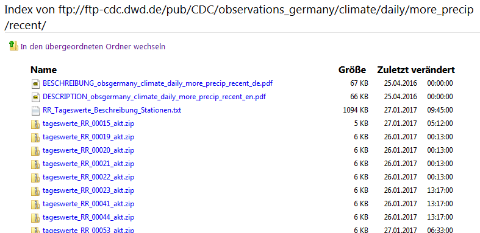

```{r setup, include=FALSE}
knitr::opts_chunk$set(echo = FALSE)
```

## The German Weather Service (DWD) provides over 25'000 climate datasets



## `rdwd` aids assessing that data


<!---->


## Overview
- Motivation
- Usage instructions
- Scientific applications

## Overview
- Motivation
- **Usage instructions**
- Scientific applications


## Get dataset link with `selectDWD`

```{r libr, echo = TRUE}
library("rdwd")
```

```{r link, echo = TRUE}
link <- selectDWD("Potsdam", res="daily", var="kl", per="recent")
```

```{r linkprint, echo = FALSE}
cat(gsub("/daily", "/\n/daily", link))
```

## Download file with `dataDWD`

```{r file, echo = TRUE}
file <- dataDWD(link, read=FALSE)
file
```

## Unzip file and read actual data with `readDWD`

```{r read, echo = TRUE}
clim <- readDWD(file)
str(clim)
```

## Data can be plotted with regular R code

```{r tempplot, echo=2:3}
par(mar=c(4,4,2,0.5), mgp=c(2.7, 0.8, 0), cex=0.8)
plot(clim[,c(2,4)], type="l", xaxt="n", las=1, main="Daily temp Potsdam")
berryFunctions::monthAxis(ym=TRUE)   ;   abline(h=0)
mtext("Source: Deutscher Wetterdienst", adj=-0.1, line=0.5, font=3)
```

## Overview

- Motivation
- Usage instructions
- **Scientific applications**

## Long term climate graph
```{r climgraph, echo=1:5, message=FALSE}
clim <- dataDWD(selectDWD("Potsdam", res="monthly", var="kl", per="h"))
clim$month <- substr(clim$MESS_DATUM_BEGINN,5,6)
temp <- tapply(clim$LUFTTEMPERATUR, clim$month, mean)
prec <- tapply(clim$NIEDERSCHLAGSHOEHE, clim$month, mean)
berryFunctions::climateGraph(temp, prec, main="Potsdam 1893:2015")
mtext("Source: Deutscher Wetterdienst", adj=-0.05, line=2.8, font=3)
```


