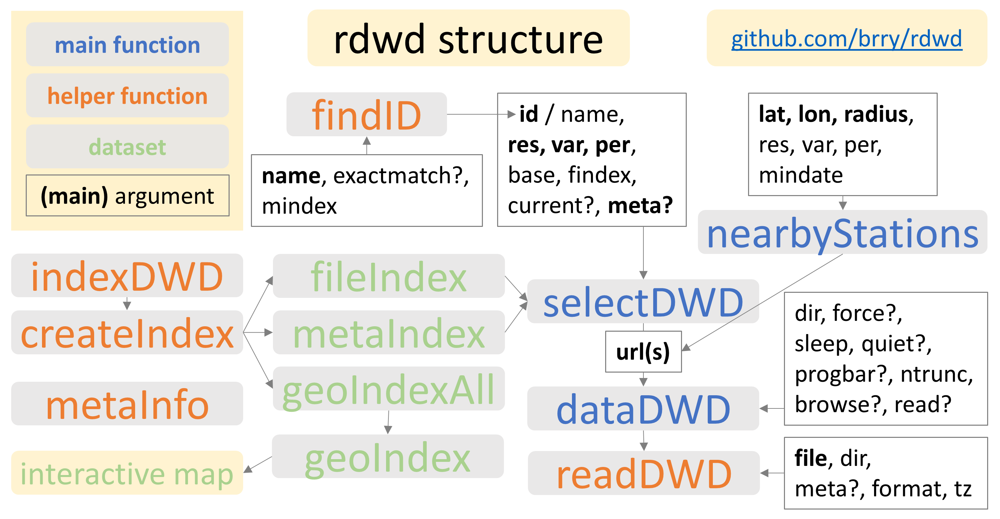

[Vignette Rmd source code](https://raw.githubusercontent.com/brry/rdwd/master/vignettes/rdwd.Rmd)

[Interactive map vignette](mapDWD.html)


### Intro

The [R](https://www.r-project.org/) package `rdwd`, available at [github.com/brry](https://github.com/brry/rdwd), 
contains code to select, download and read weather data from measuring stations across Germany. 
The German Weather Service (Deutscher Wetterdienst, DWD) provides 
over 25 thousand datasets with weather observations through the FTP server online at 

<ftp://ftp-cdc.dwd.de/pub/CDC/observations_germany/climate>.


### Package structure

To use those datasets, `rdwd` has been designed to mainly do 3 things:

* `selectDWD`: facilitate file selection, e.g. for certain station names (with `findID`), 
by geographical location (see `mapDWD`), by temporal resolution (hourly, daily, monthly), 
variables (temperature, rain, wind, sun, clouds, etc) or
observation period (historical long term records or the current year)

* `dataDWD`: download a file (or multiple files without getting banned by the FTP-server)

* `readDWD`: read that data into R (including useful defaults for metadata)

`selectDWD` uses the result from `indexDWD` which recursively lists all the files on an FTP-server (using RCurl::getURL).
As this is time consuming, the result is stored in the package dataset `fileIndex`.
From this, `metaIndex`, `geoIndex`, `mapDWD` and `metaInfo` are derived.



[TOC](#top)


### Package installation

```{r install, eval=FALSE}
install.packages("rdwd")
# get the latest development version from github:
berryFunctions::instGit("brry/rdwd") 

# For full usage, as needed in indexDWD and metaDWD(..., current=TRUE):
install.packages("RCurl") # is only suggested, not mandatory dependency
```

```{r library}
library(rdwd)
```

If direct installation from CRAN doesn't work, your R version might be too old. 
In that case, an update is really recommendable: [r-project.org](https://www.r-project.org/). 
If you can't update R, try installing from source (github) via `instGit` as mentioned above. 
If that's not possible either, here's a manual workaround that might work for most functions:
On the github package page, click on **Clone or Download -> Download ZIP** (topright, [link](https://github.com/brry/rdwd/archive/master.zip)), unzip the file to some place, then
```R
setwd("that/path")
dd <- dir("rdwd-master/R", full=T)
dummy <- sapply(dd, source)
```
This creates all R functions as objects in your globalenv workspace (and overwrites existing objects of the same name!).

[TOC](#top)


### Basic usage

```{r basics, eval=TRUE}
tdir <- tempdir()
link <- selectDWD("Potsdam", res="daily", var="kl", per="recent")
file <- dataDWD(link, read=FALSE, dir=tdir)
clim <- readDWD(file, dir=tdir)

str(clim)
```
[TOC](#top)


### Plotting examples

Recent temperature time series:
```{r plot, eval=TRUE, fig.height=3, fig.width=7}
par(mar=c(4,4,2,0.5), mgp=c(2.7, 0.8, 0), cex=0.8)
plot(clim[,c(2,4)], type="l", xaxt="n", las=1, main="Daily temp Potsdam")
berryFunctions::monthAxis(ym=TRUE)   ;   abline(h=0)
```

Long term climate graph:
```{r climgraph, eval=TRUE, fig.height=3, fig.width=7}
link <- selectDWD("Potsdam", res="monthly", var="kl", per="h")
clim <- dataDWD(link)
clim$month <- substr(clim$MESS_DATUM_BEGINN,5,6)
temp <- tapply(clim$LUFTTEMPERATUR, clim$month, mean)
prec <- tapply(clim$NIEDERSCHLAGSHOEHE, clim$month, mean)
library(berryFunctions)
climateGraph(temp, prec, main="Potsdam 1893:2015")
```


[TOC](#top)


### Station selection

Weather stations can be selected geographically with the [interactive map](mapDWD.html).

The DWD station IDs can be obtained from station names with
```{r findID, eval=TRUE}
findID("Potsdam")
findID("Koeln", exactmatch=FALSE)
```

[TOC](#top)


### Available files

File selection by station name/id and folder happens with `selectDWD`.
It needs an index of all the available files on the server.
The package contains such an index (`fileIndex`) that is updated (at least) with each CRAN release of the package.
The `selectDWD` function documentation contains an overview of the FTP folder structure.

```{r fileIndex, eval=TRUE}
head(rdwd:::fileIndex) # 28'798 rows in Jan 2017 (with some almost duplicate files)
```
If you find this to be outdated (Error in download.file ... : cannot open URL),
please let me know and I will update it. Meanwhile, use current=TRUE in `selectDWD`:

```{r files, eval=FALSE}
# all files at a given path, with current file index (RCurl required):
links <- selectDWD(res="monthly", var="more_precip", per="hist", current=TRUE)
```

`fileIndex` is created with the function `indexDWD` at 
<https://github.com/brry/rdwd/blob/master/R/meta.R#L185>.
```{r listfiles, eval=FALSE}
# recursively list files on the FTP-server:
files <- indexDWD("hourly/sun") # use dir="some_path" to save the output elsewhere
berryFunctions::headtail(files, 5, na=TRUE)

# with other FTP servers, this should also work...
funet <- indexDWD(base="ftp.funet.fi/pub/standards/RFC/ien", folder="")
p <- RCurl::getURL("ftp.funet.fi/pub/standards/RFC/ien/",
                       verbose=T, ftp.use.epsv=TRUE, dirlistonly=TRUE)
```

[TOC](#top)


### File selection

`selectDWD` is designed to be very flexible:

```{r select1, eval=FALSE, echo=TRUE}
# inputs can be vectorized, and period can be abbreviated:
selectDWD(c("Potsdam","Wuerzburg"), res="hourly", var="sun", per="hist")
```

```{r select2, eval=TRUE, echo=FALSE}
lapply(selectDWD(c("Potsdam","Wuerzburg"), res="hourly", var="sun", per="hist"), function(x) gsub("ical/", "ical/ ", x))
```

```{r select3, eval=FALSE, echo=TRUE}
# Time period can be doubled to get both filenames:
selectDWD("Potsdam", res="daily", var="kl", per="rh", outvec=TRUE)
```

```{r select4, eval=TRUE, echo=FALSE}
gsub("/tages", "/ tages", selectDWD("Potsdam", res="daily", var="kl", per="rh", outvec=TRUE))
```

There may be a differing number of available files for several stations across al folders.
That's why the default outvec is FALSE.

```{r select5, eval=TRUE}
lapply(selectDWD(id=c(3467,5116)), substr, 58, 1e4)
```

[TOC](#top)


### Metadata

`selectDWD` also uses a complete data.frame with meta information, `metaIndex` 
(derived from the "Beschreibung" files in `fileIndex`).
```{r meta23, eval=TRUE}
# All metadata at all folders:
data(metaIndex)
str(metaIndex, vec.len=2)
```
```{r metaView, eval=FALSE}
View(data.frame(sort(unique(rdwd:::metaIndex$Stationsname)))) # 5831 entries
```

`dataDWD` can download (and `readDWD` can correctly read) such a data.frame from any folder on the FTP server:
```{r meta1, eval=TRUE}
# file with station metadata for a given path:
m_link <- selectDWD(res="monthly", var="more_precip", per="hist", meta=TRUE)
substr(m_link, 50, 1e4) # (Monatswerte = monthly values, Beschreibung = description)
```
```{r meta2, eval=FALSE}
meta_monthly_rain <- dataDWD(m_link, dir=tdir) # not executed in vignette creation
str(meta_monthly_rain)
```

Meta files may list stations for which there are actually no files.
For example: Tucheim (5116) is listed in the metadata at
[.../monthly/more_precip/recent/RR_Monatwerte_Beschreibung_Stationen.txt](ftp://ftp-cdc.dwd.de/pub/CDC/observations_germany/climate/monthly/more_precip/recent/RR_Monatwerte_Beschreibung_Stationen.txt),
but actually has no file in that folder (only in .../monthly/more_precip/__historical__).

[TOC](#top)

